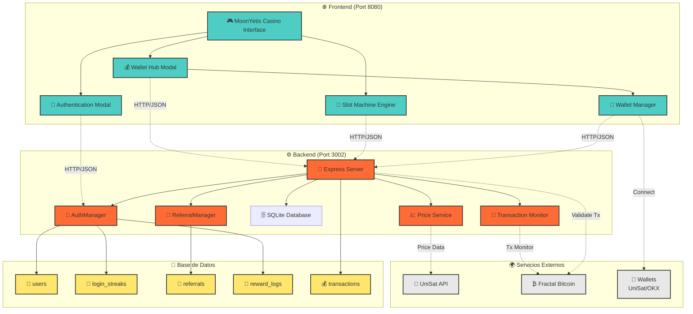
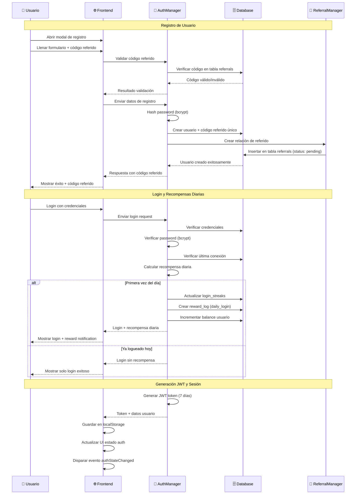
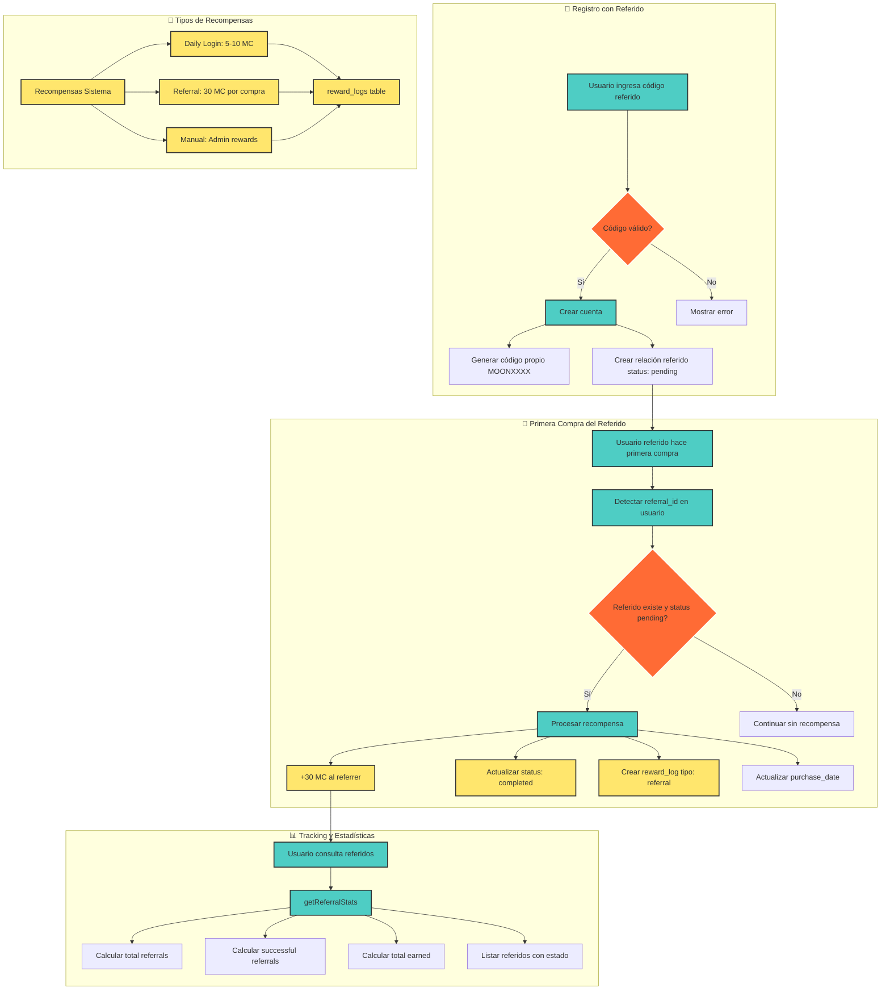
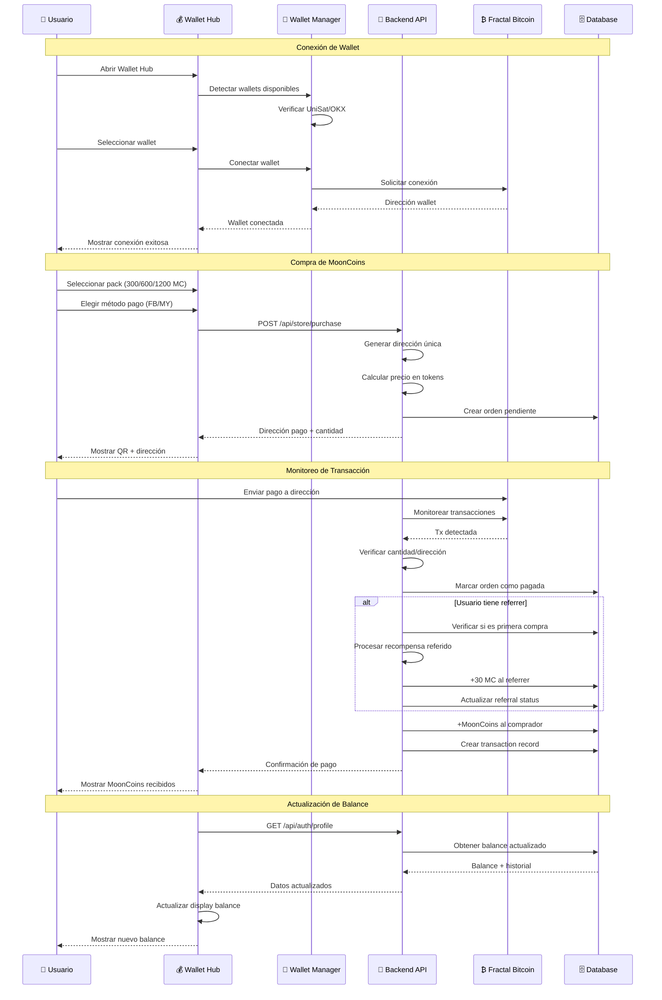
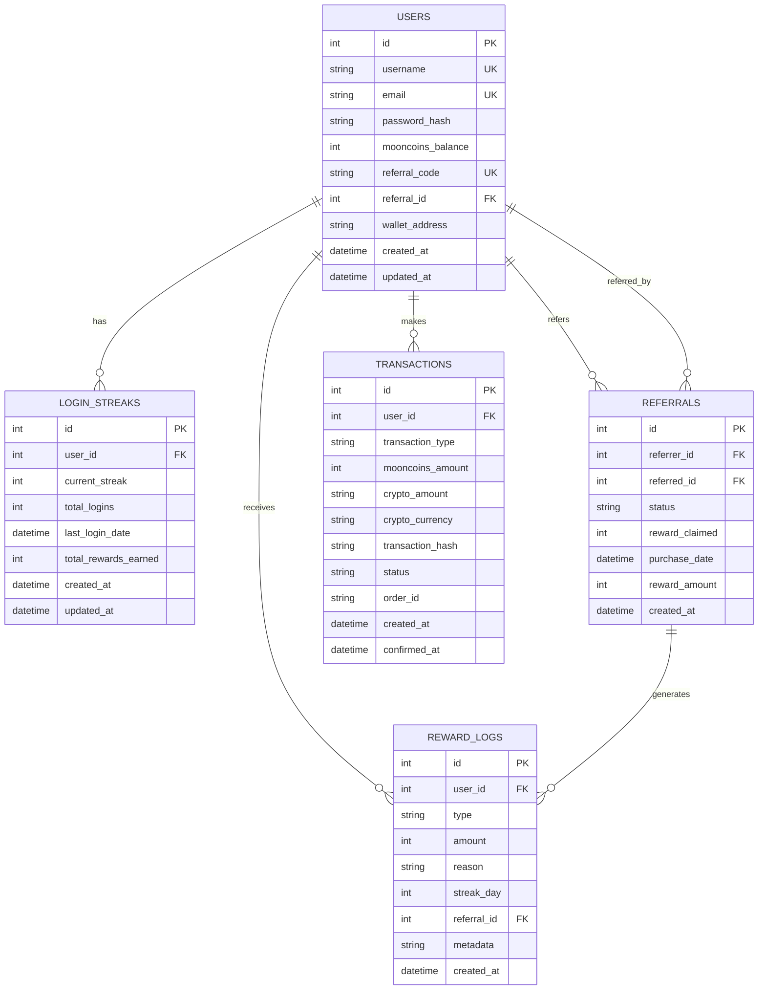
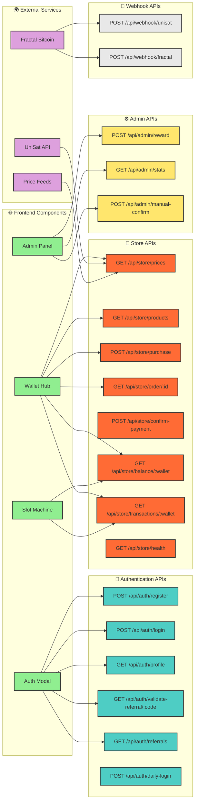
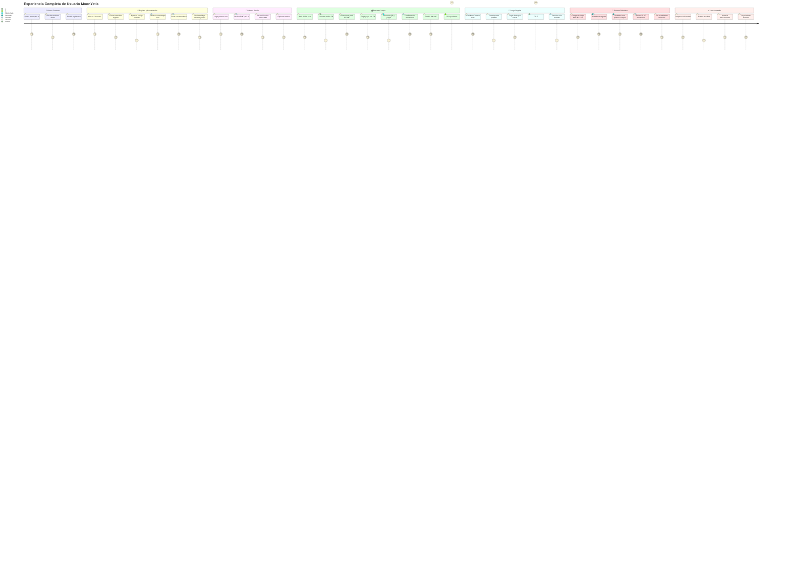

# 📊 MoonYetis Casino - Diagrama Completo del Sistema

## 🏗️ Arquitectura General del Sistema

## 🔐 Flujo de Autenticación Completo

## 👥 Sistema de Referidos Completo

## 💰 Integración Wallet Hub y Compras

## 🗄️ Esquema de Base de Datos

## 🔗 Mapa de APIs y Endpoints

## 🎮 Flujo de Usuario Completo

## 📊 Resumen de Funcionalidades Implementadas

### ✅ **Sistema de Autenticación**
- Registro con username/email/password
- Login con JWT tokens (7 días)
- Validación de códigos de referido en tiempo real
- Sesiones persistentes con localStorage
- Logout completo con limpieza de estado

### ✅ **Sistema de Recompensas Diarias**
- Ciclo de 7 días: 5, 5, 8, 8, 10, 10, 4 MC = 50 MC total
- Reset automático si se rompe la racha
- Tracking completo en tabla login_streaks
- Notificaciones visuales en frontend

### ✅ **Sistema de Referidos**
- Códigos únicos formato MOONXXXX (8 chars)
- 30 MC por primera compra de referido
- Estados: pending → completed
- Estadísticas completas y tracking
- Validación en tiempo real

### ✅ **Wallet Hub Híbrido**
- Soporte para wallets UniSat/OKX
- Conexión a Fractal Bitcoin network
- Balance display (MY tokens, FB, MoonCoins)
- Compra de packs: 300, 600, 1200 MC
- Historial de transacciones
- Funciones de retiro (withdraw)

### ✅ **Base de Datos Completa**
- SQLite con better-sqlite3
- 5 tablas relacionadas
- Índices optimizados
- WAL mode para concurrencia
- Manejo de transacciones

### ✅ **APIs RESTful**
- 16 endpoints principales
- Autenticación JWT
- Validación de datos
- Manejo de errores
- Documentación de respuestas

### ✅ **Integración Blockchain**
- Precios en tiempo real (UniSat API)
- Monitoreo de transacciones
- Confirmaciones automáticas
- Soporte BRC-20 (MoonYetis)
- Fractal Bitcoin nativo

### ✅ **Frontend Responsivo**
- Modales con animaciones CSS
- Validación de formularios
- Estados de carga
- Notificaciones de sistema
- Diseño mobile-first

---

**🚀 Sistema completamente funcional listo para producción en el ecosistema Fractal Bitcoin**